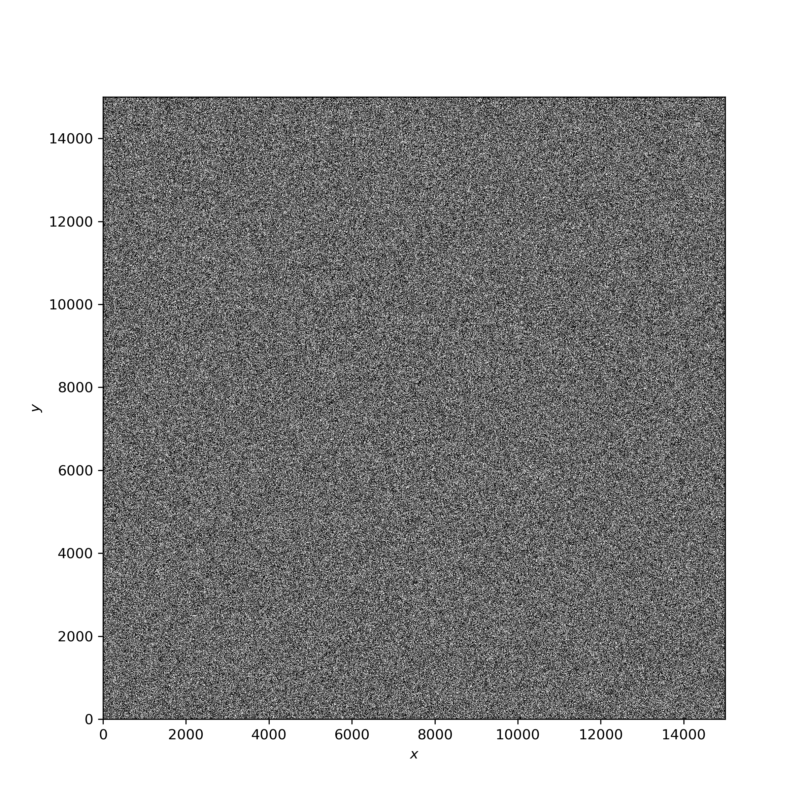

Site Percolation
=====
> 2D Site Percolation

2D site Percolation using the Hoshen Kopelman algorithm, using the Union-Find generalization. For this, a nxn grid is filled randomly as occupied (1) or unoccupied (0). If there exists a cluster (set of connected sites) that spans from one side to the opposite side, then the system percolates.

<figure>
  
  <figcaption>Fig.1 - Random grid for P=0.6 and L=1000. </figcaption>
</figure>

<figure>
  
  <figcaption>Fig.2 - Clusters for P=0.6 and L=1000. The system percolates. </figcaption>
</figure>
